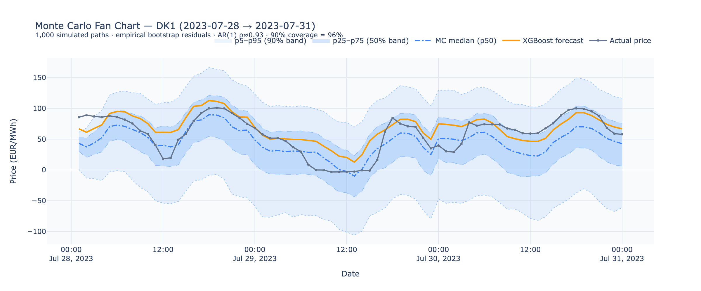
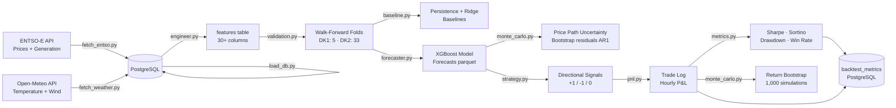

# Nordic Power Price Forecaster & Strategy Backtester

**Day-ahead electricity price forecasting and systematic trading strategy for the DK1 and DK2 Nordic bidding zones.**

 

---

## Overview

This project builds an end-to-end quantitative pipeline for the Danish day-ahead electricity market: fetching hourly price and generation data from ENTSO-E and Open-Meteo, engineering 30+ features, training an XGBoost forecaster using walk-forward cross-validation, and running a systematic long/short backtest on the resulting price signals.

The two bidding zones — **DK1** (Jutland/Funen, interconnected with Germany and the Netherlands) and **DK2** (Zealand, interconnected with Sweden and Germany) — are modelled separately, reflecting their distinct generation mix and cross-border flow dynamics. XGBoost achieves **37.4 EUR/MWh MAE on DK1** (+5.9% over persistence) and **35.3 EUR/MWh on DK2** (+15.7% over persistence) on genuine out-of-sample walk-forward folds. The directional strategy produces an annualised **Sharpe ratio of 16.6 on DK1** at the default 5% entry threshold, with the Monte Carlo bootstrap stress test confirming a p5 Sharpe of 11.4 across 1,000 alternate historical paths.

---



*XGBoost point forecast overlaid on actual DK1 prices with bootstrapped 50% and 90% prediction intervals. Out-of-sample test fold, Jul 2023.*

---

## Architecture



---

## Results

All metrics computed on out-of-sample data. Backtest threshold = 5%. Portfolio = equal-weight 50% DK1 + 50% DK2.

| Metric | DK1 | DK2 | Portfolio |
|---|---|---|---|
| XGBoost MAE (EUR/MWh) | 37.4 | 35.3 | — |
| Persistence MAE (EUR/MWh) | 39.7 | 41.9 | — |
| MAE improvement over persistence | +5.9% | +15.7% | — |
| Annualised Sharpe ratio | 16.6 | 14.3 | 14.6 |
| Sortino ratio | 21.0 | 19.5 | — |
| Max drawdown (EUR/MWh) | −266.2 | −767.9 | −384.0 |
| Win rate | 72.3% | 65.0% | — |
| Profit factor | 3.18 | 2.88 | — |
| Trade count | 649 | 4,751 | — |
| Monte Carlo p5 Sharpe | 11.4 | — | — |
| Monte Carlo p50 Sharpe | 17.3 | — | — |
| Monte Carlo p95 Sharpe | 25.1 | — | — |

> **Note:** The high Sharpe ratios reflect the use of a rolling-mean forward price proxy rather than real exchange-quoted forwards. See [Limitations](#limitations).

---

## Project Structure

```
.
├── src/
│   ├── pipeline/
│   │   ├── fetch_entso.py        # ENTSO-E API client — prices + generation, monthly chunks, retry logic
│   │   ├── fetch_weather.py      # Open-Meteo API client — temperature + wind speed for Aarhus and Copenhagen
│   │   └── load_db.py            # PostgreSQL loader — idempotent ON CONFLICT DO NOTHING inserts
│   ├── features/
│   │   └── engineer.py           # 30+ feature engineering steps — lags, calendar, generation, weather, target
│   ├── models/
│   │   ├── validation.py         # Walk-forward expanding-window fold generator
│   │   ├── baseline.py           # Persistence and Ridge regression baselines
│   │   ├── forecaster.py         # XGBoost training loop — one model per zone, saves forecasts parquet
│   │   ├── shap_analysis.py      # SHAP feature importance plots
│   │   └── monte_carlo.py        # Price path uncertainty — AR(1) bootstrap residuals, 1,000 paths
│   └── backtest/
│       ├── strategy.py           # Signal generation — long/short/flat based on forecast vs forward proxy
│       ├── pnl.py                # Hourly P&L calculation and trade log construction
│       ├── metrics.py            # Sharpe, Sortino, max drawdown, win rate, profit factor
│       ├── analysis.py           # Threshold sensitivity and regime analysis
│       ├── portfolio.py          # Multi-zone portfolio construction and correlation analysis
│       └── monte_carlo.py        # Return bootstrap stress test — 1,000 resampled P&L paths
├── notebooks/
│   ├── 01_eda.ipynb              # Exploratory data analysis — price distributions, seasonality, correlation
│   ├── 02_features.ipynb         # Feature engineering walkthrough and correlation heatmap
│   ├── 03_modeling.ipynb         # Walk-forward results, SHAP, Monte Carlo fan chart
│   └── 04_backtest.ipynb         # Equity curve, regime analysis, threshold sensitivity, heatmaps
├── db/
│   └── schema.sql                # PostgreSQL schema — 5 tables: spot_prices, generation, weather, features, backtest_metrics
├── scripts/
│   ├── load_metrics_to_db.py     # Load backtest results into PostgreSQL
│   └── verify_db.py              # Row count and date range verification queries
├── docs/
│   ├── methodology.md            # Technical deep-dive — pipeline, validation, modelling, backtesting
│   ├── interview_prep.md         # 20 Q&As for quant trading interviews
│   └── images/
│       └── forecast_vs_actuals.png  # Hero chart — forecast vs actuals with MC confidence bands
├── data/
│   ├── raw/                      # CSV backups of ENTSO-E and Open-Meteo pulls
│   └── results/                  # Parquet and CSV outputs from each phase
├── docker-compose.yml            # PostgreSQL container — one-command database setup
├── Makefile                      # Targets: install, db, phase1–4, pipeline, clean
├── requirements.txt              # Python dependencies
└── .env.example                  # Environment variable template
```

---

## Quickstart

### Prerequisites

- Python 3.11+
- Docker (for PostgreSQL)
- ENTSO-E API key — register at [transparency.entsoe.eu](https://transparency.entsoe.eu/usrm/user/createPublicUser)

### Setup

```bash
# Clone the repository
git clone https://github.com/Z0h4ib/Nordic-Power-Price-Forecaster-Strategy-Backtester.git
cd Nordic-Power-Price-Forecaster-Strategy-Backtester

# Create environment file
cp .env.example .env
# Edit .env with your DB credentials and ENTSO-E API key

# Install Python dependencies
make install

# Start PostgreSQL and apply schema
make db

# Run the full pipeline
make pipeline
```

### What `make pipeline` does

| Phase | Command | Description | Expected runtime |
|---|---|---|---|
| Phase 1 | `make phase1` | Fetch ENTSO-E data, weather, load to DB | 15–30 min (API rate limits) |
| Phase 2 | `make phase2` | Feature engineering, save to `features` table | ~2 min |
| Phase 3 | `make phase3` | Train baselines, XGBoost, SHAP, Monte Carlo | ~5 min |
| Phase 4 | `make phase4` | Strategy backtest, metrics, bootstrap stress test | ~3 min |

> Phase 1 is rate-limited by the ENTSO-E API. The client fetches in monthly chunks with a 2-second inter-request pause and 3-attempt exponential backoff on 503 errors.

### Environment variables (`.env`)

```ini
DB_HOST=localhost
DB_PORT=5432
DB_NAME=nordic_power
DB_USER=postgres
DB_PASSWORD=your_password
ENTSO_E_API_KEY=your_key_here
```

---

## Methodology

Full technical detail in [`docs/methodology.md`](docs/methodology.md). Summary:

- **Walk-forward validation**: Expanding window with 168-hour test blocks. DK1: 5 folds. DK2: 33 folds. Temporal ordering strictly enforced — no lookahead.
- **Feature engineering**: Cyclical sin/cos encoding for hour and month; price lags at 1h, 24h, 48h, 168h; `wind_total_mw` and `renewables_ratio` to capture merit-order price suppression from high renewable penetration.
- **Model selection**: XGBoost over ARIMA (non-linear interaction capture, native missing-value handling) and LSTM (insufficient training data for sequence models to outperform gradient boosting on tabular inputs at this scale).
- **Signal generation**: Long/short/flat based on XGBoost forecast vs a 168-hour rolling mean used as a forward price proxy. Forward price is synthetic — see Limitations.
- **Monte Carlo (dual use)**: (1) Price path uncertainty via AR(1)-filtered bootstrap residuals (95.8% empirical coverage at 90% interval); (2) return bootstrap on daily P&L to stress-test the Sharpe distribution across alternate historical paths.
- **Regime analysis**: Strategy P&L concentrates in the post-2023 stabilisation period. During the 2022 energy crisis and post-crisis recovery, model-derived signals generate minimal edge — gas market shocks and geopolitical drivers have no representation in the feature set.

---

## Limitations

1. **Forward price is synthetic.** The strategy uses a 168-hour trailing mean of actual spot prices as a proxy for the forward price. In production this would be replaced by a real exchange-listed forward quote (EPEX or Nasdaq Commodities). The synthetic proxy inflates the apparent Sharpe because the strategy effectively bets the model's own forecast against the model's own recent average — with a directionally accurate model, this wins far too reliably.

2. **No transaction costs or slippage.** P&L is computed on clean mark-to-market prices with no bid/ask spread, brokerage commission, or market impact model. In liquid day-ahead markets bid/ask spreads are typically 0.01–0.1 EUR/MWh, which is negligible relative to the signal magnitude, but this should be modelled explicitly before any live deployment.

3. **Constant position sizing.** All trades are sized at 1 MW regardless of signal confidence or forecast uncertainty. A Kelly criterion or confidence-weighted sizing framework would improve the Sharpe/drawdown ratio without altering the signal logic.

4. **Fixed hyperparameters.** XGBoost hyperparameters (`best_params.json`) were selected by observing the full backtest period rather than inside the walk-forward loop. A production system would retune periodically using a nested validation scheme to avoid hyperparameter lookahead bias.

---

## Tech Stack

| Library | Purpose |
|---|---|
| `entsoe-py` | ENTSO-E Transparency Platform API client |
| `requests` | Open-Meteo REST API calls |
| `pandas` | Data manipulation and time-series operations |
| `numpy` | Numerical operations and Monte Carlo vectorisation |
| `sqlalchemy` + `psycopg2` | PostgreSQL ORM and driver |
| `python-dotenv` | Environment variable loading |
| `xgboost` | Primary forecasting model |
| `scikit-learn` | Ridge regression baseline, metrics |
| `shap` | Feature importance attribution |
| `holidays` | Danish public holiday calendar |
| `statsmodels` | AR(1) residual autocorrelation estimation |
| `plotly` | Interactive charts in notebooks |
| `matplotlib` + `seaborn` | Static plots and heatmaps |
| `jupyter` | Notebook execution |
| `docker-compose` | PostgreSQL container orchestration |

---

## Author

**Zohaib Asghar**
MSc student, Danmarks Tekniske Universitet (DTU)

- GitHub: [github.com/Z0h4ib](https://github.com/Z0h4ib)
- LinkedIn: [linkedin.com/in/zohaib-asghar](https://linkedin.com/in/zohaib-asghar)
